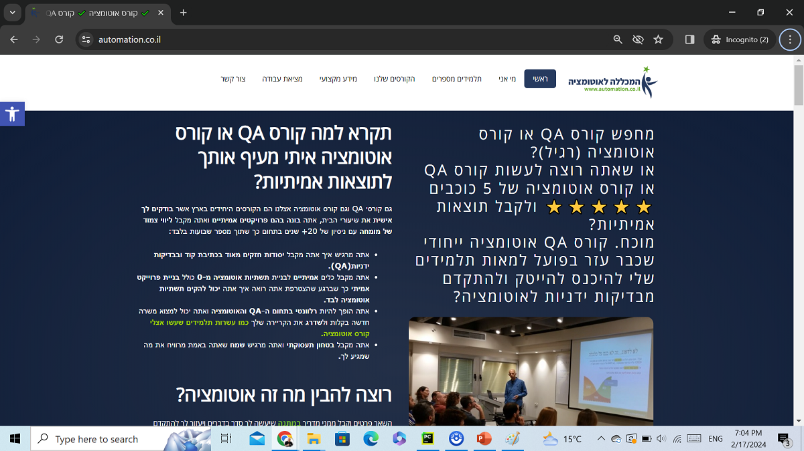

# Tutorials Ninja Automation

## 📌 Project Overview
This project is an automation framework for testing the **Tutorials Ninja** website. It is built using **Java, Selenium WebDriver, TestNG**, and **Maven**, following best practices in test automation.

## 🛠️ Technologies Used
- **Java** - Programming language for automation scripts
- **Selenium WebDriver** - Browser automation
- **TestNG** - Test framework for structuring and running test cases
- **Maven** - Dependency management and build tool
- **ExtentReports** - Test reporting framework
- **Page Object Model (POM)** - Design pattern for maintainable test scripts

## 📂 Project Structure
```
TutorialsNinjaAutomation/
│── src/
│   ├── main/java/
│   │   ├── pages/          # Page Object Model classes
│   │   ├── utils/          # Utility classes
│   │   ├── config/         # Configuration files
│   ├── test/java/
│   │   ├── tests/          # Test cases
│── pom.xml                 # Maven dependencies
│── testng.xml              # TestNG configuration file
│── README.md               # Project documentation
```

## 🚀 Installation & Setup
### Prerequisites
Make sure you have the following installed:
- Java (JDK 8 or higher)
- Maven
- ChromeDriver (compatible with your Chrome version)

### Clone the Repository
```sh
git clone https://github.com/artyomchernenko/TutorialsNinjaAutomation.git
cd TutorialsNinjaAutomation
```

### Install Dependencies
```sh
mvn clean install
```

### Run Tests
```sh
mvn test
```

Or, using TestNG:
```sh
mvn test -DsuiteXmlFile=testng.xml
```

## 📊 Test Reports
After test execution, reports will be generated in the `target/surefire-reports` directory. If using **ExtentReports**, find the HTML report in:
```
target/extent-reports/ExtentReport.html
```
Open it in a browser to view test results.

## 📌 Future Enhancements
- Add support for running tests in parallel
- Implement CI/CD pipeline with GitHub Actions or Jenkins
- Integrate with an external test management tool

## 📞 Contact
If you have any questions or suggestions, feel free to reach out via GitHub issues.

---
**Happy Testing! 🚀**


<a href="https://www.automation.co.il">
    
</a>

# 💻 My Automation Project 
✅ This is a testing automation demo project that tests a real site called: 
www.automation.co.il
- [x] This example is for the automation college students only (`המכללה לאוטומציה`)

 ⭐⭐⭐⭐⭐

## 📖 Overview

This repository contains a comprehensive automated testing project built with Java, TestNG, and Allure Reports. 
The project follows the Page Object Model (POM) design pattern for a modular and maintainable test suite.

<p>
  
</p>

## 📑 Technologies & Skill & Features
| Technologies      | Description |
| ----------- | ----------- |
| **Java:**      | The project is developed using Java, providing a robust and widely used programming language for automation.       |
| **TestNG:**   | TestNG is used as the testing framework, offering powerful test configuration options, parallel execution, and detailed reporting.        |
| **Selenium WebDriver:**   | The project includes Selenium WebDriver for automating browser interactions        |
| **Page Object Model (POM):**   | The project follows the POM design pattern, enhancing test maintainability and reusability by separating page elements and actions.        |
| **Allure Reports:**   | Test results are documented using Allure Reports, providing a clear and interactive visualization of test execution.        |
| **Jenkins:**   | Continuous integration and continuous delivery (CI/CD) platform for automated builds and deployments.        |


## 📊 Reports
  ```bash
  mvn allure:serve
  ```
## 📊 Reports Examples
<p>
  
  
</p>


## 📖 Prerequisites

- Write here your Prerequisites if exists.

## 🚀 Getting Started

1. **Clone the Repository:**
   ```bash
   git clone https://github.com/your-username/your-repo.git
    ```

## 📁 Project Structure
```
├───.settings
├───bin
│   ├───pages
│   └───tests
├───src
│   ├───pages
│   └───tests
└───test-output
    ├───Default suite
    ├───junitreports
    └───old
        └───Default suite
```

Thanks for visiting my GitHub profile! 😊
Gal Matalon 
<p>
  
</p>
https://www.automation.co.il


